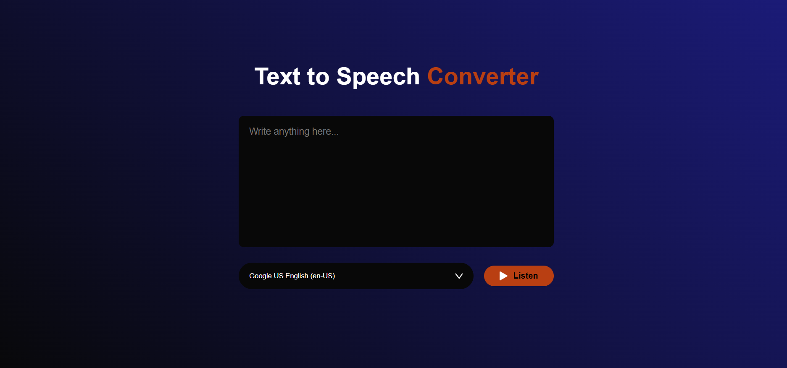

# Text to Speech Converter

This is a simple Text-to-Speech (TTS) web app built with HTML, CSS, and JavaScript using the Web Speech API. It allows users to input text, choose from available system voices, and listen to the spoken output.



## Tech Stack
- HTML5
- CSS3
- JavaScript (Vanilla)
- Web Speech API

## Features
- Converts written text to spoken audio
- Supports multiple voices and languages (based on browser/system)
- Clean and responsive UI with voice selection
- Instant playback with a click

## How to Use
- Clone or download this repository.
    ```sh
    git clone https://github.com/Balaji-R-05/text-to-speech-converter.git
    ```
- Open the index.html file in your browser.
- Type any text in the textarea.
- Select your preferred voice from the dropdown.
- Click the Listen button to hear it spoken aloud.

## Notes
- Make sure your browser has voice support enabled and permissions allowed.
- The list of voices depends on the user's device and browser.
- Some voices may require internet access or system-level support.